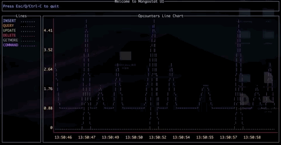

# Mongo Monitor

This is a mongo monitor! Now, the main functionality of this project is the terminal dashboard of `opcounters` just like the visualization of `mongostat`. It lets you understand the metrics of your mongo database more intuitively. I will add more metrics on the dashboard in the future. And welcome any feedback and your contribution to this project.

## Screen Shot



## Environment

1. Go v1.12.3 or up

## Execution

```bash
go mod download
go run main.go mongostat --ui --interval 1 --uri $YOUR_MONGO_URI
```

## TODO Metrics on Dashboard

- [ ] replica set status
- [ ] data size of each replica set
- [ ] number of clients Read/Write in progress or in the queue
- [ ] utility of CPU/Memory
- [ ] notification(slack, email) when the specific metrics achieve the threshold
